# Vivero Good Vibras

El proyecto Vivero Good Vibras, es un sitio web de un comercio ficticio. Hecho para el curso de Desarrollo Web Front-End  de BA Multiplica2.0 2023.
En el cual, se plasma un poco de la historia del comercio, los productos y servicios con los que cuenta. Atraves del formulario de contacto se pueden realizar pedidos, como asi tambien por los multiples canales de comunicacion con los que se cuenta. Ya sea telefono, direccion, correo electronico y redes sociales.

link al repositorio https://github.com/RomiinaC/Multiplicate2.0

## Author

- Romina Carranza [@RomiinaC](https://github.com/RomiinaC)

## Deployment

https://romiinac.github.io/Multiplicate2.0/

## Color Reference

| Color             | Hex                                                                |
| ----------------- | ------------------------------------------------------------------ |
| Carrot Orange |  #eb9520 |
| Killarney |  #306b39 |
| Atlantis |  #7fcb26 |
| Bright Green |  #71ff1f |

Se utilizo una paleta de colores vibrantes que denotan un sitio destructurado, alegre y simple.
La gama que se utilizo de verdes y anaranjado, hacen referencia a la naturaleza jovial. 

## Screenshots

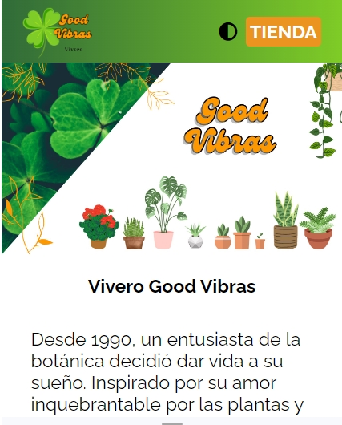
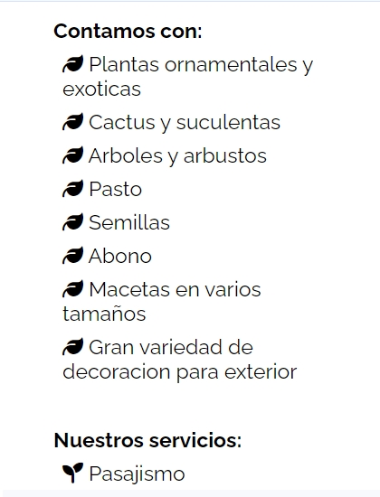
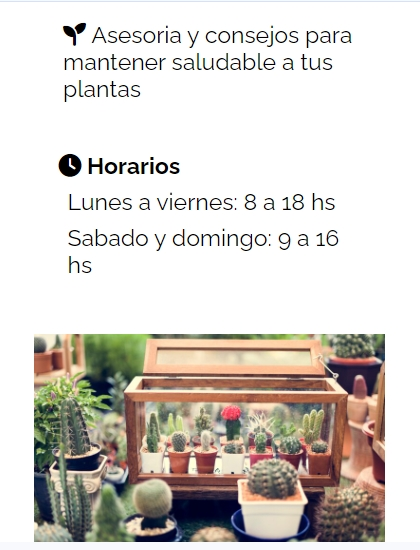
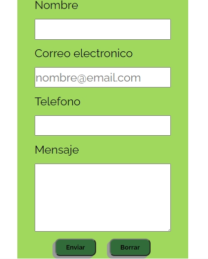
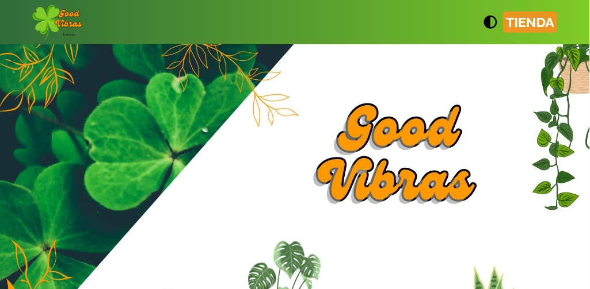
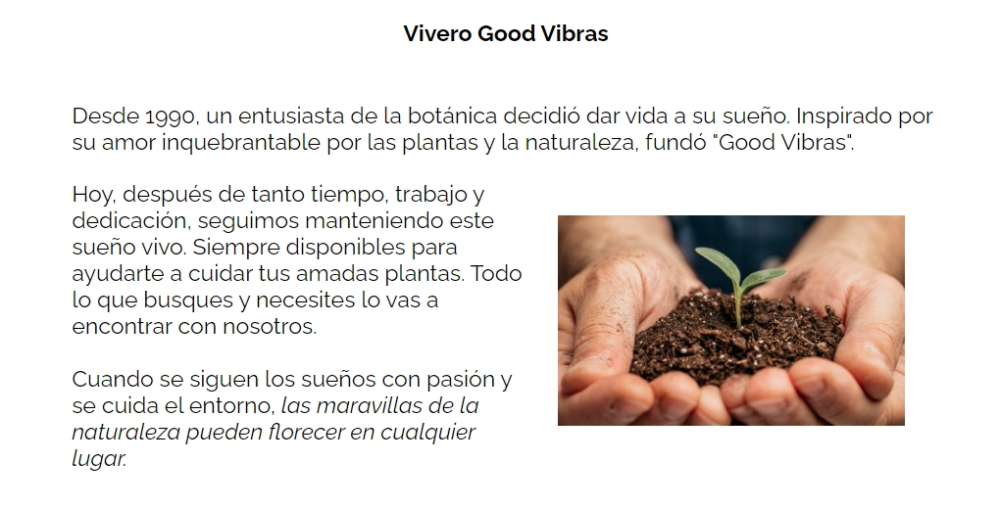
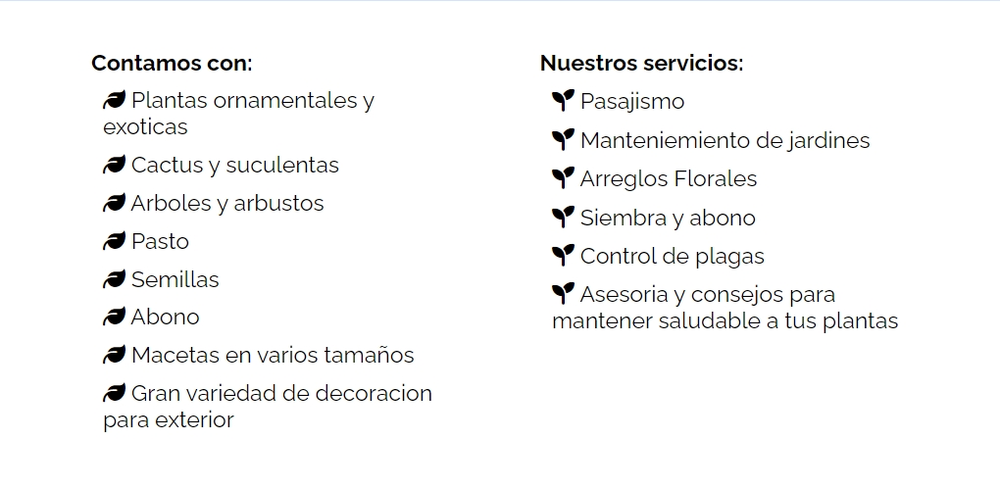
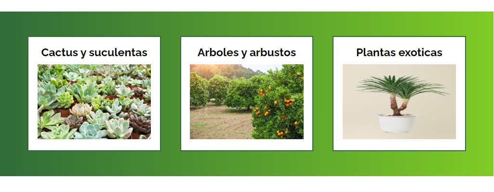
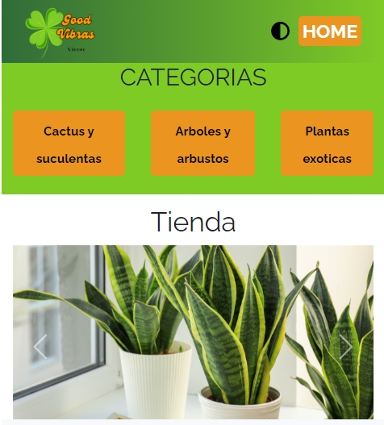
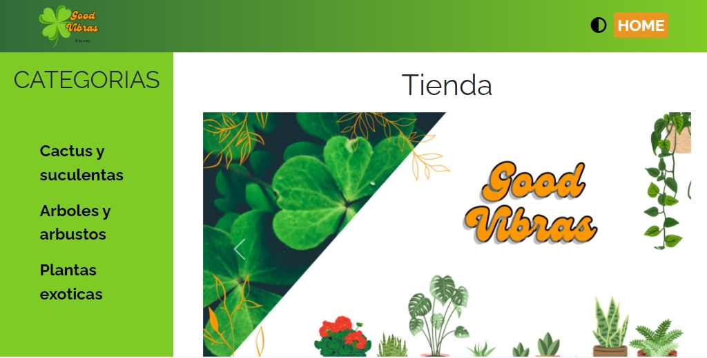
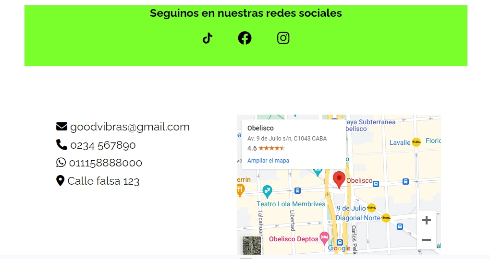

## Features

- Light/dark mode toggle
- Live previews
- Fullscreen mode

## Used By

This project is used by:

- Curso Front-end BA Multiplica

